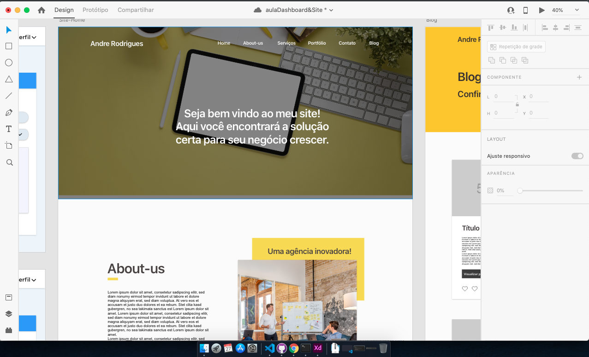

# ProjetoCMS-PHP

## Repositório para projeto CMS feito do zero
  

## Proposta
 A proposta desse minicurso feito com lives no Facebook é o desnevolvimento de um CMS do Zero. O CMS irá usar tecnologias mais usadas na web, além disso, será desenvolvido com metodologias para manter sempre uma qualidade tanto na camada Front e Back-End.

## Ferramentas usadas 

### Design:
No desenvolvimento do layout do painel e site, foi utilizado o software de prototipagem da Adobe, o AdobeXD.  
### Front-End:
Será usado HTML, CSS, JavaScript e Ajax
### Back-End
Usaremos PHP e Mysql

## Observações:
O layout e código poderão ser baixados a qualquer momento nesse repositório, mas caso for usar para fins comerciais, eu agardeceria muito se coloca-se os créditos em meu nome, pois, durante o processo de criação houve um processo de estudo e grande trabalho. Caso queira contribuir para compras de matériais, hospedagem e domínio, entre em contato comigo pelo e-mail: andrelaurentinomg@gmail.com. 

 Que todos tenham um ótimo estudo :) .

